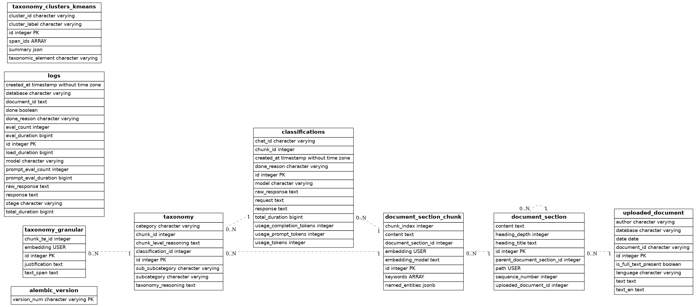
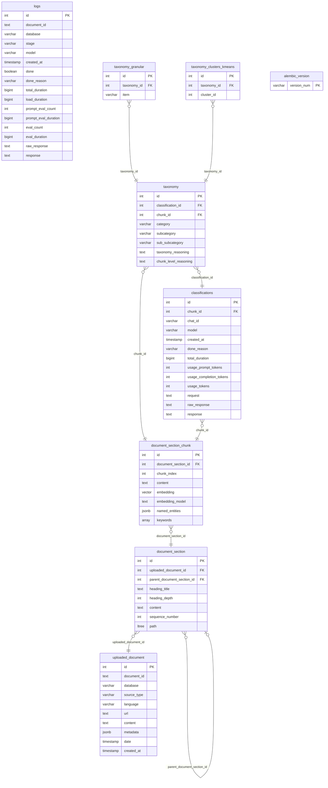

# Database Entity Relationship Diagram

Generated on: 2025-06-05 23:18

## Visual ERD

## Mermaid ERD

## Database Statistics

- **Total Tables**: 9
- **Total Columns**: 74
- **Total Relationships**: 8
- **Total Rows**: ~2.9 million

## Table Row Counts

| Table | Row Count |
|-------|-----------|
| uploaded_document | 63,536 |
| document_section | 524,964 |
| document_section_chunk | 473,734 |
| taxonomy | 213,965 |
| classifications | 161,296 |
| logs | 548,725 |
| taxonomy_granular | 446,362 |
| taxonomy_clusters_kmeans | 0 |
| alembic_version | 1 |

## Key Relationships

1. **Document Hierarchy**:
   - `uploaded_document` → `document_section` → `document_section_chunk`
   - Documents are split into sections, which are split into chunks

2. **Classification Flow**:
   - `document_section_chunk` → `classifications` → `taxonomy`
   - Chunks are classified, and those classifications produce taxonomy entries

3. **Taxonomy Extensions**:
   - `taxonomy` → `taxonomy_granular` (granular items)
   - `taxonomy` → `taxonomy_clusters_kmeans` (clustering results)

## Special Columns

- **keywords** (in `document_section_chunk`): PostgreSQL array of text strings containing multi-word key phrases
- **named_entities** (in `document_section_chunk`): JSONB array with format `[{"text": "...", "label": "..."}]`
- **embedding** (in `document_section_chunk`): Vector embeddings for similarity search
- **path** (in `document_section`): Hierarchical path using PostgreSQL's ltree type